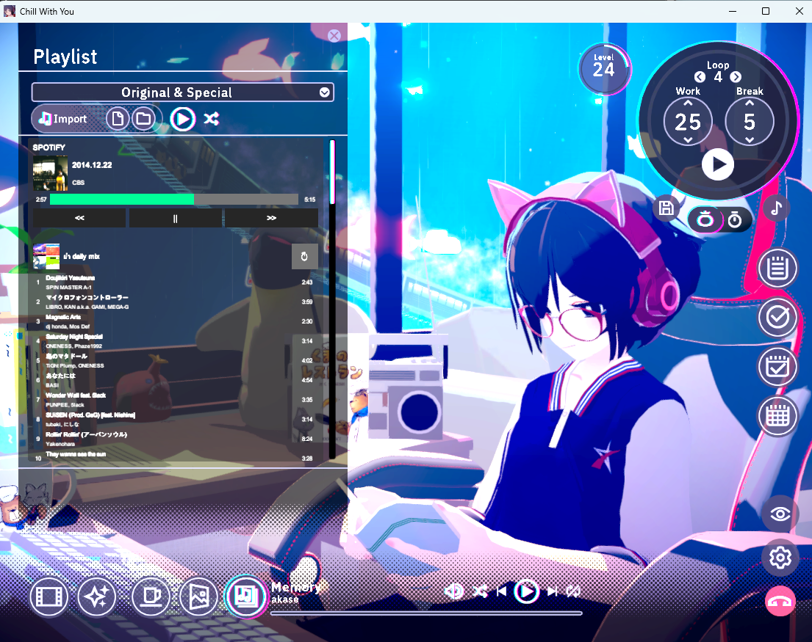

# ChillWithYou Spotify Mod

BepInEx mod สำหรับเกม **Chill with You: Lo-Fi Story** — เพิ่มเครื่องเล่น Spotify เข้าไปในเกม ควบคุมเพลง ค้นหา และเลือกเพลย์ลิสต์ได้โดยไม่ต้องสลับหน้าจอออกจากเกม



> ⚠️ **จำเป็นต้องมีบัญชี Spotify Premium** — Spotify Web API อนุญาตให้สั่งควบคุมการเล่นเพลง (play/pause/skip) เฉพาะบัญชี Premium เท่านั้น บัญชีฟรีจะล็อกอินได้แต่สั่งเล่นเพลงไม่ได้

## ฟีเจอร์

- ล็อกอิน Spotify ด้วย OAuth 2.0 (Authorization Code + PKCE) — ไม่ต้องใช้ client secret
- จำ session ไว้ในเครื่อง (เข้ารหัสด้วย Windows DPAPI) เปิดเกมใหม่ไม่ต้องล็อกอินซ้ำ
- ควบคุมการเล่นเพลง เล่น/หยุด/ข้าม จาก UI ในเกม
- ค้นหาเพลงและเลือกเพลย์ลิสต์ของตัวเองได้
- มี rate limiter กันยิง API ถี่เกินไป

## การติดตั้ง (สำหรับผู้เล่น)

1. ติดตั้ง [BepInEx 5.x (x64)](https://github.com/BepInEx/BepInEx/releases) ลงในโฟลเดอร์เกม แล้วเปิดเกม 1 ครั้งเพื่อให้ BepInEx สร้างโฟลเดอร์
2. นำไฟล์ **ทั้งสอง** จาก `bin\Release\netstandard2.1\` (build เองตามขั้นตอนด้านล่าง) ไปวางใน `<โฟลเดอร์เกม>\BepInEx\plugins`:
   - `ChillWithYou_SpotifyMod.dll`
   - `System.Security.Cryptography.ProtectedData.dll` — มอดใช้เข้ารหัส refresh token ด้วย Windows DPAPI ถ้าขาดไฟล์นี้ **ล็อกอินจะไม่สำเร็จ** (แลก token แล้ว error `Could not load file or assembly`)
3. เปิดเกม แล้วกดปุ่มล็อกอิน Spotify ในเกม — เบราว์เซอร์จะเปิดหน้าอนุญาตของ Spotify ให้กดยืนยัน

## การสร้าง Spotify App (จำเป็นก่อน build)

มอดต้องใช้ **Client ID** ของคุณเองจาก Spotify Developer Dashboard:

1. ไปที่ [developer.spotify.com/dashboard](https://developer.spotify.com/dashboard) แล้วล็อกอินด้วยบัญชี Spotify ของคุณ
2. กด **Create app** ตั้งชื่อ/คำอธิบายอะไรก็ได้
3. ในช่อง **Redirect URIs** ใส่ค่านี้ให้ตรงเป๊ะ (ห้ามลืม `/` ท้าย):
   ```
   http://127.0.0.1:8901/callback/
   ```
4. เลือก API ที่ใช้เป็น **Web API** แล้วกด Save
5. เข้าไปหน้า Settings ของแอป คัดลอก **Client ID** มาใช้กับสคริปต์ build ด้านล่าง

> ใช้แค่ Client ID เท่านั้น **ไม่ต้องใช้ Client Secret** เพราะมอดใช้ OAuth แบบ PKCE

## Build แบบง่าย (แนะนำ)

ต้องมี [.NET SDK 8.0 ขึ้นไป](https://dotnet.microsoft.com/download) (พัฒนา/ทดสอบด้วย 10.0.302) และตัวเกม (พร้อม BepInEx ติดตั้งแล้ว) จากนั้นเปิด PowerShell ในโฟลเดอร์โปรเจกต์แล้วรัน:

```powershell
.\build.ps1
```

สคริปต์จะถาม Client ID แล้ว build DLL ให้เสร็จสรรพ (ใส่ ID ผ่าน parameter ก็ได้):

```powershell
.\build.ps1 -ClientId "your32charclientid"

# ถ้าเกมไม่ได้อยู่ path เริ่มต้น ระบุเองได้:
.\build.ps1 -ClientId "..." -GameDir "C:\Program Files (x86)\Steam\steamapps\common\Chill with You Lo-Fi Story"
```

ได้ไฟล์ใน `bin\Release\netstandard2.1\` และถ้าเจอโฟลเดอร์เกม จะ copy **ทั้ง `ChillWithYou_SpotifyMod.dll` และ `System.Security.Cryptography.ProtectedData.dll`** เข้า `BepInEx\plugins` ให้อัตโนมัติ — Client ID จะถูกฝังใน DLL เท่านั้น ไฟล์ซอร์สโค้ดจะถูกคืนค่าเดิมหลัง build เสมอ

> ถ้ารันสคริปต์ไม่ได้เพราะ execution policy ให้รันด้วย `powershell -ExecutionPolicy Bypass -File .\build.ps1`

## การ build เอง (ไม่ใช้สคริปต์)

แก้ไฟล์ `SpotifyAuth.cs` แทนที่ `ENTER_YOUR_CLIENT_ID` ด้วย Client ID ของคุณ:

```csharp
private const string ClientId = "ENTER_YOUR_CLIENT_ID";
```

โปรเจกต์อ้างอิง DLL จากโฟลเดอร์เกมโดยตรง ค่าเริ่มต้นชี้ไปที่:

```
F:\Program Files (x86)\Steam\steamapps\common\Chill with You Lo-Fi Story
```

ถ้าเกมอยู่ที่อื่น ให้สร้างไฟล์ `GameDir.props` (ไฟล์นี้ไม่ถูก commit) ไว้ข้าง ๆ `.csproj`:

```xml
<Project>
  <PropertyGroup>
    <GameDir>C:\Program Files (x86)\Steam\steamapps\common\Chill with You Lo-Fi Story</GameDir>
  </PropertyGroup>
</Project>
```

จากนั้น:

```
dotnet build
```

หลัง build สำเร็จ ทั้ง `ChillWithYou_SpotifyMod.dll` และ dependency `System.Security.Cryptography.ProtectedData.dll` จะถูก copy เข้า `BepInEx\plugins` ของเกมให้อัตโนมัติ (ถ้าโฟลเดอร์มีอยู่)

> ถ้าหาโฟลเดอร์เกมไม่เจอ (ไม่ได้ตั้ง `GameDir.props`) ต้อง copy เองจาก `bin\Release\netstandard2.1\` — อย่าลืมเอา **ทั้งสองไฟล์** ไปด้วย ไม่ใช่แค่ `ChillWithYou_SpotifyMod.dll` มิฉะนั้นล็อกอิน Spotify จะไม่สำเร็จ

## โครงสร้างโค้ดคร่าว ๆ

| ไฟล์ | หน้าที่ |
|---|---|
| `plugin.cs` | จุดเริ่มต้นปลั๊กอิน + MainThreadDispatcher |
| `SpotifyAuth.cs` | OAuth PKCE flow + local callback server |
| `SpotifyTokenStore.cs` | เก็บ token ลงเครื่องแบบเข้ารหัส (DPAPI) |
| `SpotifyWebApi.cs` / `SpotifyApi.cs` / `SpotifyApiClient.cs` | เรียก Spotify Web API |
| `SpotifySearchApi.cs` | ค้นหาเพลง |
| `SpotifyRateLimiter.cs` | จำกัดความถี่การเรียก API |
| `SpotifyButtonInjector.cs` | สร้าง/ฉีด UI เครื่องเล่นเข้าไปในเกม |
| `PlaylistSelectionUI.cs` | UI เลือกเพลย์ลิสต์ |
| `UiSprites.cs` | สร้าง sprite/texture ของ UI ด้วยโค้ด (ไม่ต้องมีไฟล์รูปแนบ) |
| `TrackInfo.cs` | โมเดลข้อมูลเพลงที่กำลังเล่น + helper อัปเดต UI |
| `SpotifyPatches.cs` | Harmony patches |

## ข้อจำกัดจาก Spotify Web API (Development Mode)

แอปที่คุณสร้างตามขั้นตอนด้านบนจะอยู่ใน **Development Mode** ซึ่ง Spotify ตัด endpoint ออกไปหลายตัว มอดนี้จึงทำบางอย่างไม่ได้ **ไม่ใช่บั๊ก** และแก้ในโค้ดไม่ได้:

| ทำไม่ได้ | สาเหตุ |
|---|---|
| ดูรายชื่อเพลงฮิตของศิลปินก่อนกดเล่น | `/artists/{id}/top-tracks` ถูกตัด (ก.พ. 2026) — กด artist จะสั่งเล่นเลย แล้วค่อยเห็นคิวเพลงจริงจาก `/me/player/queue` |
| กดเลือกเพลงในคิวตอนเล่นจากศิลปิน | Spotify ไม่รับ `offset` เมื่อ context เป็น artist (รองรับแค่ album/playlist) — คิวจะแสดงให้ดูได้ แต่กดข้ามไปเพลงที่ต้องการไม่ได้ ใช้ปุ่ม next แทน<br>เล่นเพลงนั้นเดี่ยวๆ ก็ทำได้ แต่จะหลุด context จน next/prev ไม่เดินตามศิลปินต่อ เลยเลือกไม่ทำ |
| ไล่ดูอัลบั้ม *ทั้งหมด* ของศิลปิน | `/artists/{id}/albums` ถูกตัด (ก.พ. 2026) — แต่อัลบั้มที่เจอจากการค้นหายังกดเปิดดูรายชื่อเพลงได้ปกติ |
| ดูศิลปินใกล้เคียง | `/artists/{id}/related-artists` ถูกตัด (พ.ย. 2024) |
| เปิด Daily Mix / Discover Weekly / "This Is ..." | playlist ที่ Spotify เป็นเจ้าของ อ่านผ่าน API ไม่ได้ (พ.ย. 2024) |
| ดู playlist ของศิลปิน | ไม่เคยมี endpoint นี้ — playlist เป็นของ *user* ไม่ใช่ของ artist |
| ผลค้นหาเกิน 10 รายการต่อประเภท | เพดาน `limit` ลดจาก 50 เหลือ 10 (ก.พ. 2026) — มอดใช้ 5 อยู่แล้ว |

สิ่งที่**ยังใช้ได้ปกติ**: ควบคุมการเล่น (play/pause/next/prev), ค้นหา, playlist ของตัวเอง, ข้อมูลเพลงที่กำลังเล่น

> ข้อจำกัดพวกนี้ผูกกับ Development Mode — แอปที่ได้ **Extended Quota Mode** จะไม่โดน แต่ต้องยื่นขอและผ่านการรีวิวจาก Spotify ซึ่งมอดนี้ไม่ได้ยื่น เพราะทำขึ้นเพื่อเรียนรู้/ใช้ส่วนตัว
>
> อ้างอิง: [ประกาศ พ.ย. 2024](https://developer.spotify.com/blog/2024-11-27-changes-to-the-web-api) · [migration guide ก.พ. 2026](https://developer.spotify.com/documentation/web-api/tutorials/february-2026-migration-guide)

## ข้อจำกัดอื่น ๆ

- ต้องใช้บัญชี **Spotify Premium** ในการควบคุมการเล่นเพลง
- รองรับเฉพาะ Windows (การเก็บ token ใช้ DPAPI)
- ในโค้ดไม่มี secret ใด ๆ — ใช้แค่ Client ID (public client แบบ PKCE) ที่คุณสร้างเองตามขั้นตอนด้านบน
- มอดนี้ไม่มีส่วนเกี่ยวข้องกับผู้พัฒนาเกมหรือ Spotify

## ขอบคุณ

มอดนี้ทำขึ้นเพื่อเรียนรู้ และเรียนรู้จากงานของคนอื่นเกือบทั้งหมด — ขอบคุณครับ:

- **fraguledust**, **Ecaphet** และ **ALMIA** — ผมแกะโค้ดมอดของสามท่านนี้เพื่อเรียนรู้วิธีทำ หลายอย่างในมอดนี้เข้าใจได้เพราะได้อ่านงานของพวกเขาก่อน
- ทีม [**BepInEx**](https://github.com/BepInEx/BepInEx) และ [**HarmonyLib**](https://github.com/pardeike/Harmony) ที่ทำให้การ mod เกม Unity เป็นเรื่องที่คนทั่วไปเริ่มต้นได้จริง มอดนี้แทบไม่ได้ทำอะไรเองเลยนอกจากต่อยอดจากสองตัวนี้
- **modder ในคอมมูนิตี้เกม Unity** ที่เขียนบทความ ตอบกระทู้ และเปิดซอร์สโค้ดของตัวเองไว้ให้อ่าน — เทคนิคหลายอย่างในมอดนี้ (การหา GameObject ในซีน, การฉีด UI เข้าไปในเกมที่ไม่ได้ออกแบบมาให้ต่อเติม, การ patch ด้วย Harmony) มาจากงานที่คนอื่นแกะไว้ก่อนแล้วทั้งนั้น
- ผู้พัฒนา **Chill with You: Lo-Fi Story** ที่ทำเกมบรรยากาศดีจนอยากฟังเพลงของตัวเองในนั้น

> ถ้าคุณเป็นเจ้าของงานที่มอดนี้หยิบมาใช้แล้วยังไม่ถูกให้เครดิตตรงนี้ เปิด issue มาได้เลย ยินดีเพิ่มให้ครับ

## License

[MIT](LICENSE) © pw_txr
