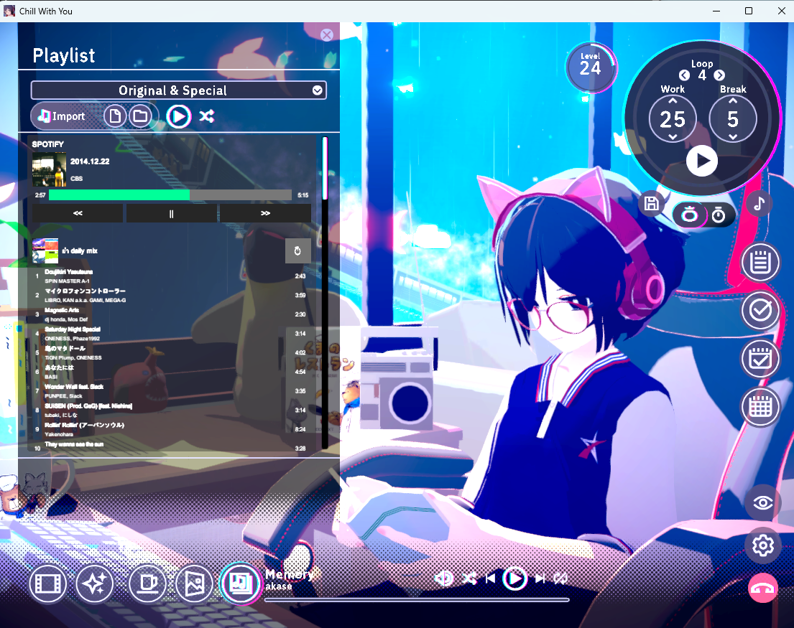

# ChillWithYou Spotify Mod

A BepInEx mod for **Chill with You: Lo-Fi Story** — adds an in-game Spotify player so you can control playback, search, and pick playlists without alt-tabbing out of the game.



> ⚠️ **A Spotify Premium account is required** — the Spotify Web API only allows playback control (play/pause/skip) on Premium accounts. Free accounts can log in but can't control playback.

## Features

- Spotify login via OAuth 2.0 (Authorization Code + PKCE) — no client secret needed
- Remembers your session locally (encrypted with Windows DPAPI), so you don't have to log in again on the next launch
- Control playback — play / pause / skip — from the in-game UI
- Search tracks and pick your own playlists
- Built-in rate limiter to avoid hammering the API

## Installation (for players)

**No .NET SDK and no building required** — the Client ID goes in a config file, not in the code.

1. Install [BepInEx 5.x (x64)](https://github.com/BepInEx/BepInEx/releases) into the game folder, then launch the game once so BepInEx creates its folders.
2. Put **both** files from the release into `<game folder>\BepInEx\plugins`:
   - `ChillWithYou_SpotifyMod.dll`
   - `System.Security.Cryptography.ProtectedData.dll` — the mod uses this to encrypt your refresh token with Windows DPAPI. If this file is missing, **login will fail** (the token exchange throws `Could not load file or assembly`).
3. Create your Spotify app and copy its Client ID (steps in the next section).
4. Launch the game once with the mod installed. This creates `<game folder>\BepInEx\config\com.pw_txr.spotifyplayer.cfg`.
5. Open that file in any text editor and paste your Client ID:
   ```ini
   [Spotify]
   ClientId = a1b2c3d4e5f6...
   ```
6. Restart the game, then click **Connect Spotify** in-game — your browser opens Spotify's authorization page; approve it.

> Prefer an environment variable? Set `CHILLWITHYOU_SPOTIFY_CLIENT_ID` instead and leave `ClientId` empty. The config file wins if both are set.
>
> If you forget this step, the panel says so when you press Connect (`no Spotify Client ID set - add it to BepInEx\config\com.pw_txr.spotifyplayer.cfg`) instead of failing silently.

## Creating a Spotify App (required)

The mod needs your own **Client ID** from the Spotify Developer Dashboard:

1. Go to [developer.spotify.com/dashboard](https://developer.spotify.com/dashboard) and log in with your Spotify account.
2. Click **Create app**. The name and description can be anything.
3. In **Redirect URIs**, enter this exactly (don't forget the trailing `/`):
   ```
   http://127.0.0.1:8901/callback/
   ```
4. Under "Which API/SDKs are you planning to use?", tick **Web API**, then Save.
5. Open the app's Settings page and copy the **Client ID** into the config file (see step 5 above).

> You only need the Client ID — **no Client Secret** — because the mod uses OAuth with PKCE.

## Where the Client ID comes from

The mod checks three places, in this order, once at startup:

| Order | Source | Notes |
|---|---|---|
| 1 | `BepInEx\config\com.pw_txr.spotifyplayer.cfg` → `[Spotify] ClientId` | What players should use. Surrounding spaces and quotes are stripped for you |
| 2 | `CHILLWITHYOU_SPOTIFY_CLIENT_ID` environment variable | Handy for keeping the ID out of the game folder |
| 3 | A value baked in at build time | Only for source builds — see `-ClientId` below |

The value is read once in `Plugin.Awake`, so edit the file with the game closed (or restart after editing).

## Building from source (optional — for development)

You need [.NET SDK 8.0 or newer](https://dotnet.microsoft.com/download) (developed/tested with 10.0.302) and the game (with BepInEx installed). Open PowerShell in the project folder and run:

```powershell
.\build.ps1
```

No Client ID is needed to build — set it in the config file at runtime like everyone else. If you'd rather bake it into the DLL (the old behavior), pass it in:

```powershell
.\build.ps1 -ClientId "your32charclientid"

# If the game isn't at the default path, specify it:
.\build.ps1 -GameDir "C:\Program Files (x86)\Steam\steamapps\common\Chill with You Lo-Fi Story"
```

You get files in `bin\Release\netstandard2.1\`, and if the game folder is found, **both `ChillWithYou_SpotifyMod.dll` and `System.Security.Cryptography.ProtectedData.dll`** are copied into `BepInEx\plugins` automatically. With `-ClientId`, the ID is embedded only in the DLL and the source file is always restored after the build.

> If the script won't run because of the execution policy, run it with `powershell -ExecutionPolicy Bypass -File .\build.ps1`

## Building manually (without the script)

The project references DLLs directly from the game folder. The default points to:

```
F:\Program Files (x86)\Steam\steamapps\common\Chill with You Lo-Fi Story
```

If your game is elsewhere, create a `GameDir.props` file (not committed) next to the `.csproj`:

```xml
<Project>
  <PropertyGroup>
    <GameDir>C:\Program Files (x86)\Steam\steamapps\common\Chill with You Lo-Fi Story</GameDir>
  </PropertyGroup>
</Project>
```

Then:

```
dotnet build
```

After a successful build, both `ChillWithYou_SpotifyMod.dll` and its dependency `System.Security.Cryptography.ProtectedData.dll` are copied into the game's `BepInEx\plugins` automatically (if the folder exists).

> If the game folder isn't found (no `GameDir.props`), copy the files from `bin\Release\netstandard2.1\` yourself — remember to take **both files**, not just `ChillWithYou_SpotifyMod.dll`, otherwise Spotify login will fail.

## Code overview

| File | Purpose |
|---|---|
| `plugin.cs` | Plugin entry point + MainThreadDispatcher |
| `SpotifyConfig.cs` | Reads the Client ID from the BepInEx config file / environment variable |
| `SpotifyAuth.cs` | OAuth PKCE flow + local callback server |
| `SpotifyTokenStore.cs` | Stores the token on disk, encrypted (DPAPI) |
| `SpotifyGateway.cs` | The single request envelope every API call goes through: bearer header, 429 → rate limiter, retry on transient 401/403, error logging |
| `SpotifyApi.cs` | Player endpoints: now-playing info, play/pause/next/prev, play by track/context URI |
| `SpotifyWebApi.cs` | Playlists, the now-playing queue, and album track lists (with caching) |
| `SpotifySearchApi.cs` | Search (tracks / artists / albums / playlists) |
| `SpotifyRateLimiter.cs` | Blocks further calls for a while after Spotify answers 429 |
| `NowPlayingSession.cs` | Pure playback state machine (progress interpolation, play/pause anchoring) — no Unity references, covered by unit tests |
| `SpotifyButtonInjector.cs` | Assembles the player panel inside the game's menu and wires its behavior |
| `SpotifyUiKit.cs` | Game-styled widget kit: color palette, game-font discovery, circle/pill buttons, progress slider, search input |
| `UiSprites.cs` | Builds UI sprites/textures in code (no image assets needed) |
| `SpotifyPatches.cs` | Harmony patches |
| `tests/NowPlayingSession.Tests` | xUnit tests for `NowPlayingSession` — `dotnet test tests/NowPlayingSession.Tests`, no game or Unity needed |

## Spotify Web API limitations (Development Mode)

The app you created above runs in **Development Mode**, where Spotify has removed several endpoints. As a result the mod can't do some things — **these aren't bugs** and can't be fixed in code:

| Not possible | Reason |
|---|---|
| List an artist's top tracks before playing | `/artists/{id}/top-tracks` was removed (Feb 2026) — clicking an artist starts playback, then shows the real queue from `/me/player/queue` |
| Pick a specific track in the queue while playing from an artist | Spotify rejects `offset` when the context is an artist (only album/playlist are supported) — the queue is display-only there; use the next button.<br>Playing that track standalone is possible but drops the context so next/prev no longer follow the artist, so it's intentionally not done |
| Browse *all* of an artist's albums | `/artists/{id}/albums` was removed (Feb 2026) — but albums found through search can still be opened to view their track list |
| See related artists | `/artists/{id}/related-artists` was removed (Nov 2024) |
| Open Daily Mix / Discover Weekly / "This Is ..." | Spotify-owned playlists, no longer readable through the API (Nov 2024) |
| See an artist's playlists | This endpoint never existed — playlists belong to a *user*, not an artist |
| More than 10 search results per category | The `limit` cap dropped from 50 to 10 (Feb 2026) — the mod already uses 5 |
| Save/like a song, or browse the full list of your Liked Songs | The `/me/tracks` endpoint family returns `403` in Development Mode even with the correct scopes granted — tried and confirmed, see [ADR 0001](docs/adr/0001-drop-library-integration.md). You can still play Liked Songs from My Lists in the panel — it just can't be browsed track-by-track before you do |

What **still works normally**: playback control (play/pause/next/prev), search, your own playlists, and now-playing info.

> These limits are tied to Development Mode — an app granted **Extended Quota Mode** isn't affected, but that requires applying and passing Spotify's review, which this mod hasn't done since it's built for learning / personal use.
>
> References: [Nov 2024 announcement](https://developer.spotify.com/blog/2024-11-27-changes-to-the-web-api) · [Feb 2026 migration guide](https://developer.spotify.com/documentation/web-api/tutorials/february-2026-migration-guide)

## Other limitations

- A **Spotify Premium** account is required to control playback
- Windows only (token storage uses DPAPI)
- There are no secrets in the code — only a Client ID (a public PKCE client) that you create yourself using the steps above
- This mod is not affiliated with the game's developers or Spotify

## Acknowledgements

This mod was made to learn, and almost everything about it was learned from other people's work — thank you:

- **fraguledust**, **Ecaphet**, and **ALMIA** — I read through these three modders' code to learn how it's done; a lot of this mod only made sense because I got to read their work first.
- The [**BepInEx**](https://github.com/BepInEx/BepInEx) and [**HarmonyLib**](https://github.com/pardeike/Harmony) teams, who make modding Unity games something an ordinary person can actually start doing. This mod barely does anything on its own beyond building on these two.
- The **Unity game modding community** who write articles, answer threads, and open-source their own code — many of the techniques here (finding GameObjects in a scene, injecting UI into a game not designed for it, patching with Harmony) all come from work others figured out first.
- The developers of **Chill with You: Lo-Fi Story**, who made a game with such a nice atmosphere that I wanted to listen to my own music inside it.

> If you own work this mod builds on and aren't credited here yet, open an issue — happy to add you.

## Changelog

See the per-version history in [CHANGELOG.md](CHANGELOG.md).

Latest version **v1.4.0** — shuffle and repeat toggle right from the panel (with a tooltip so the small icons are readable), a volume slider sits next to the transport buttons, and a Devices button lets you switch playback to another device without leaving the game. Hovering the progress bar previews the time you're about to seek to before you click. Long playlists no longer lose track of what's playing once you're past the first 21 songs. My Lists also gets a Liked Songs row that plays your saved tracks from the top.

v1.3.0 — the panel keeps up with whatever else is driving Spotify: skip, pause or seek from your phone and the game follows within a few seconds, but only while the panel is actually open. You can also drag the progress bar to seek from inside the game.

v1.2.0 brought cover art to search results and My Lists, artist album browsing, play buttons on artist/album rows, and instant highlighting on the row you tap — plus fixes for two loops that hammered the Web API.

## License

[MIT](LICENSE) © pw_txr
